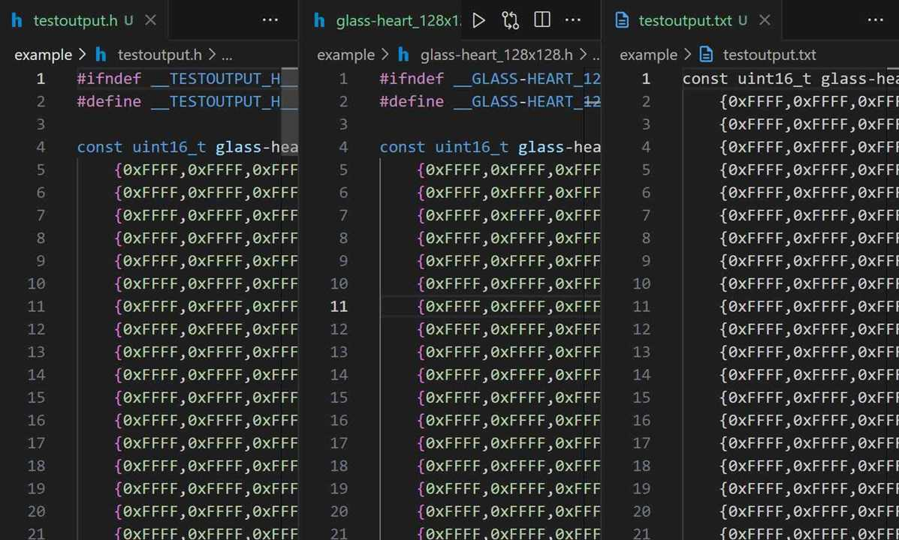

# This is Python script project

## 这个代码的主要功能是将一个图像文件转换成一个C语言风格的二维16位色值数组

### 使用示例

- 直接输出

```shell
python image2array.py glass-heart_128x128.png
```

- 就会得到同名.h文件

- 指定转为C头文件

```shell
python image2array.py glass-heart_128x128.png testoutput.h
```

- 就会得到指定.h文件

- 指定转为txt文本文件

```shell
python image2array.py glass-heart_128x128.png testoutput.txt
```

- 就会得到指定.txt文件

## 展示


